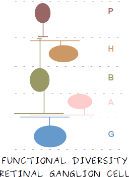

# functional-diversity-rgc

This repository contains tools to analyze retinal ganglion cells through transfer learning.

### License
This program is free software; you can redistribute it and/or modify it under the terms of the GNU General Public License as published by the Free Software Foundation; either version 3 of the License, or (at your option) any later version. See [LICENSE](LICENSE) for more information.

### Requirements
YADLRETINA requires the following Python packages:

* NumPy
* SciPy
* matplotlib
* h5py
* sklearn
* Keras
* TensorFlow
* Sonnet
* kinetics-i3d

This repository is usually tested on GNU/Linux on Python 3.6

### Contact
Rubén Crespo-Cano (rcrespocano@gmail.com)
